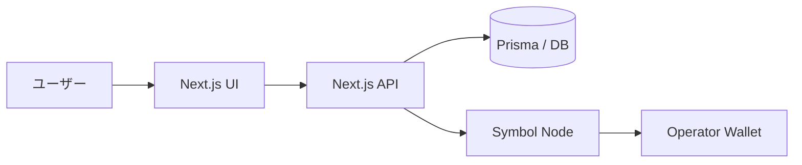
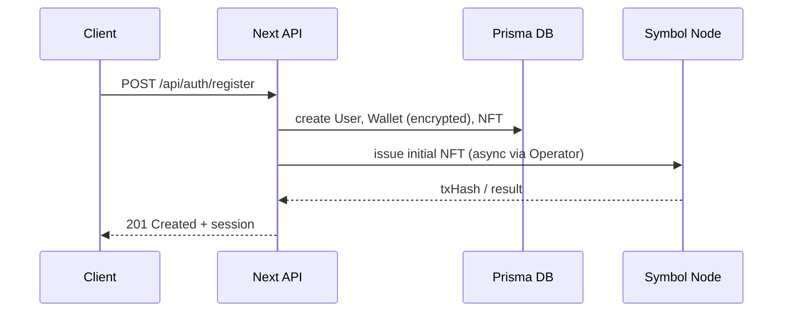
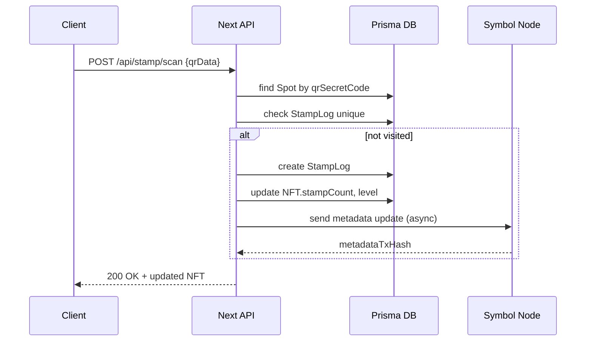

# Open Campus Stamp Rally — システム設計書

## 目的
本設計書は、リポジトリ「Open Campus Stamp Rally」の全体構成と主要コンポーネント、データモデル、主要API、主要シーケンスフロー、運用注意点をまとめ、保守・拡張のための共通理解を提供することを目的とします。

## ゴール
- 学生参加者がQRを読み取りスタンプを収集し、OC Passport（NFT）が成長する流れを支える
- 管理者がスポット・Proposal・ユーザー管理を行えること
- symbolチェーンとの連携（ウォレット生成、初期NFT付与、Metadata送信）をサポートする

## アーキテクチャ概要
- Webアプリ: Next.js（app router） + React + TailwindCSS（開発依存）
- サーバーサイド: Next.js API Routes
- DB: Prisma ORM（schema.prisma） ※開発はSQLite/Postgresを想定（環境変数で切替）
- ブロックチェーン連携: Symbol SDK / symbol-crypto-wasm-web
- 認証: メール／パスワード + セッション管理（`Session` テーブル）
- ストレージ: 画像や生成物は外部ストレージ（現状はURL保存/DB）

高レベル構成図（テキスト）

ユーザー <-> Next.js UI
  ↕
 Next.js API (認証 / スタンプ / 管理 / Proposal / Chat)
  ↕
 Prisma -> DB (SQLite/Postgres)
  ↕
 Symbol Node (OPERATOR_PRIVATE_KEY を用いた発行/Metadata送信)

## 主要コンポーネント

- 認証・セッション
  - 登録時に `User`、`Wallet`、`NFT` を作成
  - パスワードは `bcrypt` でハッシュ化
  - `Session` テーブルでトークン管理

- ウォレット管理
  - `symbol` ウォレット自動生成（登録時）
  - 秘密鍵は `WALLET_SECRET_KEY` を用いて暗号化保存（`Wallet.encryptedPrivateKey`）

- NFT / Passport
  - `NFT` テーブルで状態管理（level, stampCount, mosaicId, metadataJson 等）
  - スタンプ数に応じてlevel/称号を更新
  - dNFTメタデータ生成 → Symbol へ送信

- スタンプラリー（Spot / StampLog）
  - `Spot`：QR発行用の `qrSecretCode` を保持
  - `StampLog`：ユーザーごとの訪問記録。`@@unique([userId, spotId])` で重複防止
  - QR読み取り → Spot特定 → StampLog作成 → NFT更新 の流れ

- 管理者機能
  - スポット登録・QR発行、ユーザー管理（再付与／再送信）
  - Proposal・チャットの承認・管理

- Proposal / DAO
  - Proposal, ProposalOption, Vote モデルで投票を管理
  - Level による提案制限・投票制限

- チャット
  - ChatRoom / ChatMessage / ChatReaction で会話を管理

## データモデル（要点）
- User: id, name, email, passwordHash, isAdmin, 各種フラグ・日時
- Wallet: symbolAddress, symbolPublicKey, encryptedPrivateKey
- NFT: nftId, level, title, stampCount, mosaicId, issueTxHash, metadataJson, metadataTxHash
- Spot: spotName, floor, qrSecretCode, x/y, color, icon
- StampLog: userId, spotId, visitedAt （@@unique で重複防止）
- Proposal / ProposalOption / Vote: 提案と投票の構造
- Session: tokenHash, expiresAt（サーバーセッション管理）

（詳細は `prisma/schema.prisma` を参照）

## 主要API一覧（実装済のもの / README に基づく）
- 認証
  - `POST /api/auth/register`：ユーザー登録、Wallet/NFT初期作成
  - `POST /api/auth/login`：ログイン

- 管理者系
  - `GET /api/admin/chack`：管理者確認
  - `GET /api/admin/spots` / `POST /api/admin/spots`
  - `GET /api/admin/users` / `POST /api/admin/users/reissue` / `POST /api/admin/users/resend-metadata`
  - Proposal 承認関連: `GET/POST/PATCH /api/admin/proposals`

- スタンプ系
  - `POST /api/stamp/scan`：QR読み取り結果を受け取り、StampLog登録・NFT更新・Metadata生成

- Proposal / Vote
  - `GET /api/proposals`, `POST /api/proposals/request`, `POST /api/votes`

- チャット
  - `GET /api/chat/rooms`, `GET /api/chat/messages`, `POST /api/chat/messages`

## 主要シーケンス（代表例）

1) 新規登録の流れ
  - クライアント -> `POST /api/auth/register`（name, email, password）
  - サーバー: User 作成、symbol ウォレット生成、暗号化保存、`NFT` レコード作成、初期NFTをオンチェーン送付（非同期）
  - レスポンス: 作成済のユーザー情報（セッション発行）

2) QR 読み取り（スタンプ取得）の流れ
  - クライアント: QR データを読み取り `POST /api/stamp/scan`
  - サーバー: `qrSecretCode` から `Spot` 特定
  - 重複チェック: `StampLog` に同一 userId/spotId がないか確認
  - 新規: `StampLog` 作成、NFT.stampCount 更新、level/title 計算、dNFT metadata 生成、Symbol へ Metadata送信（非同期）

## セキュリティ設計（留意点）
- 秘密鍵の取り扱い
  - ユーザー秘密鍵は必ず暗号化して DB に保存する（`WALLET_SECRET_KEY` を環境変数で管理）
  - 運営の `OPERATOR_PRIVATE_KEY` はサーバー側で厳格に管理する

- 認可
  - 管理 API は `User.isAdmin` チェックを必須化
  - Proposal 操作や再送信等管理系は更に権限分離

- 入力検証
  - QR シークレット、Proposal テキスト、ファイル・画像アップロードなどはサニタイズ

- DB 制約
  - Prisma 側でユニーク制約や外部キー制約を明示している（schema.prisma）

## 運用・デプロイ
- 環境変数（必須）
  - `DATABASE_URL`（開発: file:./dev.db など）、`WALLET_SECRET_KEY`、`SYMBOL_NETWORK`、`SYMBOL_NODE_URL`、`OPERATOR_PRIVATE_KEY`、`INITIAL_NFT_MOSAIC_ID`

- マイグレーション
  - `npx prisma migrate dev`（開発）／`prisma migrate deploy`（本番）

- ビルド・起動
  - 開発: `npm install` → `npm run dev`
  - 本番: `npm run build` → `npm start`

- モニタリング
  - 重要: NFT 発行・Metadata TX は非同期処理のため失敗ログを保存しリトライを設ける
  - DB バックアップ（Postgres の場合）・マイグレーション手順の周知

## テスト方針
- 単体テスト
  - ビジネスロジック（level 計算、StampLog 重複チェック、Proposal 認可）をユニットテスト化

- 統合テスト
  - API エンドポイント（認証・スタンプ取得・管理者アクション）を E2E でテスト

- Web3 連携テスト
  - Symbol ノードはテストネット上で E2E を回す、TX 失敗時のリトライを検証

## 拡張案／今後の改善
- dNFT のオンチェーンでの成長表現（image/metadata の差し替え）
- 実データ向けの Postgres や外部オブジェクトストレージ移行
- 管理者向け分析ダッシュボード・スポット分析
- スケーラビリティ: 発行/Metadata送信をキュー（Redis / BullMQ など）へ移行

## 参考ファイル
- Prisma schema: `prisma/schema.prisma`
- 実装ドキュメント・README: `README_OC.md`
- 主要コード: `app/`（Next.js routes / pages）、`lib/`（Symbol / NFT / utils）

---
作成日: 2026-08-16

## 図（Mermaid）

**アーキテクチャ図**


**ユーザー登録シーケンス**


**QR読み取り（スタンプ取得）シーケンス**


## API 仕様（主要エンドポイント）
以下は現状実装済み、またはREADMEに基づく主要APIの入力/出力仕様例です。

- `POST /api/auth/register`
  - 認証: none
  - リクエスト:
    ```json
    { "name": "Alice", "email": "alice@example.com", "password": "secret" }
    ```
  - レスポンス (201):
    ```json
    { "user": { "id": 1, "name": "Alice", "email": "alice@example.com" }, "sessionToken": "..." }
    ```
  - エラー: `400`（入力不正）、`409`（既存メール）

- `POST /api/auth/login`
  - 認証: none
  - リクエスト:
    ```json
    { "email": "alice@example.com", "password": "secret" }
    ```
  - レスポンス (200):
    ```json
    { "user": { "id": 1, "name": "Alice" }, "sessionToken": "..." }
    ```

- `GET /api/admin/spots`
  - 認証: 管理者（session + `User.isAdmin`）
  - レスポンス (200): `[{ id, spotName, floor, qrSecretCode, x, y, color, icon }]`

- `POST /api/admin/spots`
  - 認証: 管理者
  - リクエスト:
    ```json
    { "spotName":"研究室A", "floor":"1F", "description":"...", "x":10, "y":20 }
    ```
  - レスポンス (201): 作成した `Spot`（`qrSecretCode` を含む）

- `POST /api/admin/users/reissue`
  - 認証: 管理者
  - リクエスト:
    ```json
    { "userId": 123 }
    ```
  - 処理: 初期NFT を再付与（オンチェーン／DB 更新）、ジョブは非同期推奨

- `POST /api/stamp/scan`
  - 認証: ログイン済み（session）
  - リクエスト:
    ```json
    { "qrData": "<qrSecretCode or encoded payload>" }
    ```
  - レスポンス (200): 更新後の `NFT` オブジェクト（level, stampCount, metadataTxHash 等）
  - エラー: `409`（既に取得済み）、`404`（Spot未発見）

- `POST /api/proposals/request`
  - 認証: ログイン（`NFT.level` による制限、例: level >= 3）
  - リクエスト例:
    ```json
    { "title":"ベンチ設置", "description":"...", "options":["賛成","反対"], "requiredLevel":3 }
    ```
  - レスポンス: 201 Created（status: pending -> 管理者承認後 approved）

- `POST /api/votes`
  - 認証: ログイン（投票重複チェック、Level制限）
  - リクエスト:
    ```json
    { "proposalId": 1, "optionId": 2 }
    ```

- チャット系
  - `GET /api/chat/rooms`：公開可能なチャットルーム一覧
  - `GET /api/chat/messages?roomId=`：メッセージ取得
  - `POST /api/chat/messages`：メッセージ投稿（level制限や削除フラグあり）

詳細なスキーマや仕様（HTTP ステータス、エラーコード、バリデーションルール）は別ファイル（`docs/API_SPEC.md`）として分割可能です。ご希望なら生成します。

## 運用手順（Runbook）
以下は本番運用／デプロイ時に必要な手順と注意点のまとめです。

1) 環境変数（必須）
  - `DATABASE_URL`（Postgres の URL。本番は Postgres 推奨）
  - `WALLET_SECRET_KEY`（ユーザー秘密鍵暗号化キー、256-bit 文字列推奨）
  - `OPERATOR_PRIVATE_KEY`（運営ウォレット秘密鍵）
  - `SYMBOL_NETWORK`, `SYMBOL_NODE_URL`, `INITIAL_NFT_MOSAIC_ID`

2) データベース準備
  - マイグレーション適用（本番）:
    ```bash
    npx prisma migrate deploy
    ```
  - Prisma Client 生成:
    ```bash
    npx prisma generate
    ```

3) ビルド & 起動
  - ビルド:
    ```bash
    npm ci
    npm run build
    ```
  - 起動 (PM2 / systemd 推奨):
    ```bash
    NODE_ENV=production DATABASE_URL="..." npm start
    ```

4) 非同期ジョブ（推奨）
  - NFT 発行や Metadata 送信などブロックチェーン連携は非同期化してジョブキューで処理することを推奨
  - 例: Redis + BullMQ / RabbitMQ を使用し、再試行/死活監視を実装
  - 失敗時はログと DB に `metadataTxHash=null` の状態を残し、管理画面から再送信できるようにする

5) バックアップ & リストア
  - Postgres のスナップショットを定期取得（例: daily）
  - 重要テーブル: `User`, `Wallet`（暗号化された秘密鍵）, `NFT`, `StampLog`, `Proposal`, `Vote`

6) モニタリング / アラート
  - API エラー率、ジョブ失敗率、Symbol ノード接続エラー、キュー遅延を監視
  - NFT 発行 TX の未完了や連携失敗をアラート化

7) セキュリティ
  - `OPERATOR_PRIVATE_KEY` と `WALLET_SECRET_KEY` はシークレット管理ツールで管理（HashiCorp Vault / Cloud KMS 等）
  - データベース接続は最小権限で行う

8) ロールバック手順（簡易）
  - DB マイグレーションのロールバックは慎重に実施。マイグレーション前にスナップショット取得。
  - 重大な不具合発生時は旧バージョンに切り戻し、ジョブ再実行を行う

9) 運用チェックリスト（デプロイ毎）
  - マイグレーションが適用されたか
  - 環境変数が正しく設定されているか
  - 主要 API（healthcheck）動作確認
  - バックエンドのジョブキュー稼働確認

---
追記日: 2026-08-16
